# 技能蓝图模板库

> **使用方法**：根据需求选最相近的原型，照 mermaid 拷节点 + 参数表填字段。所有模板默认基于宗门技能 8 位 ID 体系。
>
> **mermaid 风格约定**（与编辑器一致）：
> - **方向 `LR`（左→右）**：与技能编辑器内蓝图布局一致
> - 节点框内：**中文名（粗体）** + `[英文类名]` + `ID` + 关键参数
> - 蓝色框 `[]`：主节点
> - 圆角框 `()` ：流程控制（ORDER/DELAY/SWITCH/TEMPLATE）
> - 菱形 `{}`：条件/Switch
> - 实箭头 `→`：父节点 Params 槽位指向子节点
> - 虚箭头 `-.->`：引用（RefConfigBaseNode 或 模板）
>
> **TParam 标注约定**：
> - `{V:N}` 或纯数字：普通值
> - `(属性[xxx])`：PT=1，运行时读单位属性 N 的值（xxx 是 TBattleNatureEnum 中文）
> - `(上下文[xxx])`：PT=5，运行时取上下文（xxx 是 TCommonParamType 中文，如 `主体单位实例ID`）
> - `(→效果)`：PT=2，引用别的 SkillEffectConfig 的返回值
> - `(→技能参数)`：PT=3，引用 SkillTagsConfig
> - `F=N`：Factor 值非 0 时显示

## 模板速查表

| # | 原型名 | 适用场景 | 复杂度 |
|---|--------|----------|--------|
| 1 | 单段直线子弹 | 普攻、远程招式 | ★ |
| 2 | 多段连招 | 招式 1/2/3 段累计 | ★★ |
| 3 | 扇形多发子弹 | 散射、集束 | ★★ |
| 4 | 圆形/范围 AOE | 落地伤害、群攻 | ★ |
| 5 | 位移突进 | 闪现、冲刺 | ★★ |
| 6 | 自身增益 buff | 攻速/暴击/护盾 | ★ |
| 7 | 周期持续效果 | 旋风、火环、灼烧 | ★★ |
| 8 | 召唤分身/守卫 | 木傀、分身术 | ★★★ |
| 9 | 命中事件触发 | 击杀回血、命中追加 | ★★★ |
| 10 | Switch 分支切换 | 按 Tag 切换形态 | ★★ |
| 11 | 模板调用复用 | 复用通用流程 | ★★ |

---

## 原型 1：单段直线子弹（最简）

**典型场景**：普攻招式，向目标方向射出一颗子弹，命中后造成伤害。

### Mermaid

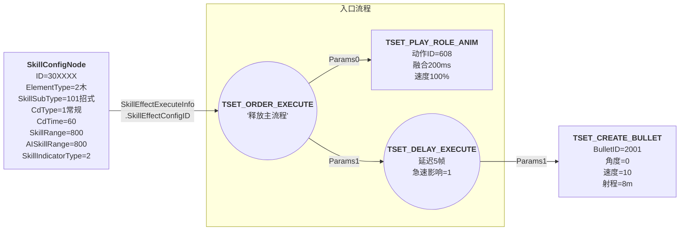

### 节点参数表

| 节点类型 | Desc | 关键参数 |
|---------|------|----------|
| `SkillConfigNode` | 技能根 | `ID=30XXXX` / `ElementType` / `SkillMainType=1` / `SkillSubType=101` / `CdType=1` / `CdTime=60` / `SkillRange=800` / `AISkillRange=800` / `SkillIndicatorType=2`(直线指示) / `SkillEffectExecuteInfo.SkillEffectConfigID = <Order的ID>` |
| `TSET_ORDER_EXECUTE` | 释放主流程 | `Params=[ <Anim ID>, <Delay ID> ]` |
| `TSET_PLAY_ROLE_ANIM` | 出招动作 | `Params=[{V:1,PT:5,即主体单位}, <动作ID>, 0, 200, 100, 1, 0,0,0,0]` |
| `TSET_DELAY_EXECUTE` | 延迟5帧后射子弹 | `Params=[5, <Bullet ID>, 0, 0, 0, 0, 1]` |
| `TSET_CREATE_BULLET` | 子弹 | `Params=[<BulletID>, 0角度, 0X, 0Y, 0创建者, 0偏移, 0前后偏, 0, 0, 0, 0, 0, 0, 0, 0]` |

**易错**：
- `SkillRange` 必须 ≥ 子弹射程；否则 AI 会站在范围外打不到
- `SkillIndicatorType=2` 是直线指示器，记得在 `SkillIndicatorParam` 填长度（如 800）

---

## 原型 2：多段连招（参考 30122001 坠叶三叠）

**典型场景**：3 段招式（招式1/2/3），每段播不同动作 + 延迟发子弹，3 段独立 CD。

**关键技巧**：用模板 `175_0103【模板】技能连招(3段).json` 自动管理 3 段输入；3 段共享同一个"发射子弹"分支（用 RefConfigBaseNode 引用）。

### Mermaid

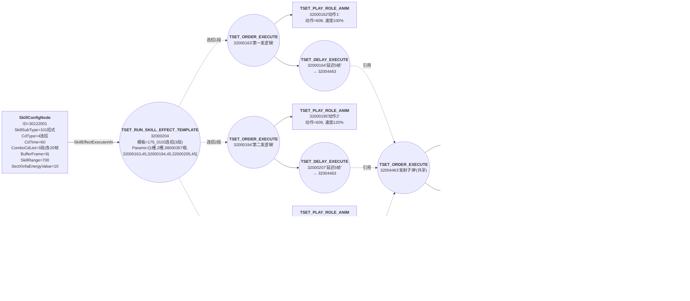

### 节点参数表（精简）

| 节点 | 参数要点 |
|------|----------|
| `SkillConfigNode` 30122001 | `CdType=4`(连招) / `ComboCdList=[(20,0,9,9,0)×3]` / `SkillEffectExecuteInfo.SkillEffectConfigID=32000204` |
| `TSET_RUN_SKILL_EFFECT_TEMPLATE` 32000204 | 模板路径 = `技能模板/技能/SkillGraph_175_0103【模板】技能连招(3段).json`，`Params=[{V:1,PT:5,即主体单位}主体, {V:2,PT:5,即目标单位}目标, 38000357模板根, 32000163,45, 32000194,45, 32000205,45]` |
| 每段 `TSET_ORDER_EXECUTE` | `Params=[<动作ID>, <延迟5帧的ID>]` |
| 每段 `TSET_PLAY_ROLE_ANIM` | `Params=[{V:1,PT:5,即主体单位}, <动作ID 608/609/610>, 0, 200融合ms, <速度100/120/150>, 1可被打断, 0, 0, 0, 0]` |
| 共享 `TSET_ORDER_EXECUTE` 32004463 | `Params=[32004464特效, 32004465Switch]` |
| `TSET_CREATE_EFFECT` 32004464 | `Params=[3200610, 91°, 59偏右, 60偏前, 30持续帧, {V:1,PT:5,即主体单位}跟随, 80%缩放, 1000ms延迟销毁, 0, 100速度%, 0, 0, 50高度, 0, 150, 0, 1]` |
| `TSET_SWITCH_EXECUTE` 32004465 | `Params=[{V:32004466,PT:2}取值, 32003945默认, 1,32004446 case1, 2,32004379 case2, 3,32003945 case3]` |
| `TSET_GET_SKILL_TAG_VALUE` 32004466 | `Params=[{V:4,PT:5,即主体伤害归属单位}拥有者, 0当前技能, 320185 TagID, 1类型, 1取最终值]` |

**易错**：
- 连招最后段 `BaseDuration` 必须 = 0
- 3 段间隔（45, 45, 45）= "3-1 间隔时间"控制连招接下次的等待
- 共享分支用 RefConfigBaseNode 引用，不要复制粘贴整套节点（容易 ID 冲突）

---

## 原型 3：扇形多发子弹

**典型场景**：散射 5 颗子弹覆盖 60° 扇形。

**关键技巧**：用 `TSET_LAYOUT_SUMMON_BULLET`（阵型创建子弹）一次性产生多颗，或用 `TSET_REPEAT_EXECUTE` 配合角度递增。

### 方案 A：阵型节点（推荐）

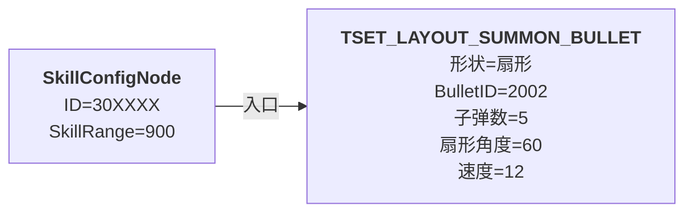

### 方案 B：REPEAT 递增角度

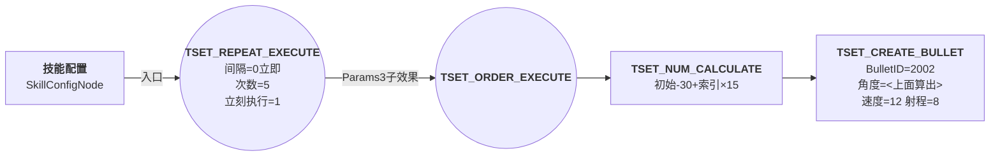

### 节点参数表（方案 A）

| 节点 | 参数要点 |
|------|----------|
| `TSET_LAYOUT_SUMMON_BULLET` | `Params=[BulletID, 形状=2扇形, 数量=5, 扇形角度=60, 内径=0, 速度=12, 朝向=朝目标]`（具体 Params 顺序见 CSV 文档第 1 份） |

**易错**：
- 5 颗子弹角度分布：`-30°, -15°, 0°, 15°, 30°`
- 子弹数为偶数时不会有"正中"子弹
- 阵型节点的子弹模型用同一份，差异只在角度

---

## 原型 4：圆形/范围 AOE

**典型场景**：在落地点造成 5m 半径圆形范围伤害。

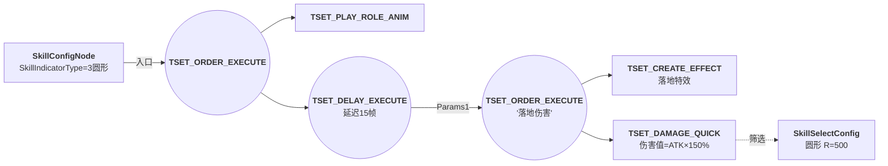

### 节点参数表

| 节点 | 参数要点 |
|------|----------|
| `SkillConfigNode` | `SkillIndicatorType=3` 圆形指示 / `SkillIndicatorParam=[500]` 半径 |
| `TSET_DELAY_EXECUTE` | 延迟到角色动作落地的帧数（典型 15-20 帧） |
| `TSET_DAMAGE_QUICK` | `Params=[<伤害值>, <五行>, 0, 0, 1物理, 0, 0, 0, 0]` |
| `SkillSelectConfig` 圆形筛选 | `Params=[半径=500, 偏移右=0, 偏移前=0, ...]`，`SpecialSkillSelectFlag=TSSSF_Common_DiJun` 敌军 |

**易错**：
- AOE 必须用 `TSET_DAMAGE_QUICK` + 筛选 ID，不要单纯 CREATE_EFFECT（特效不会判定伤害）
- 筛选 ID 通常挂在 `SkillEffectExecuteInfo.SelectConfigID` 而不是 Damage 内（看具体节点）

---

## 原型 5：位移突进（参考 30215001 奔岩突进 / 模板 175_0023 / 175_0024）

**典型场景**：角色向目标方向冲刺 5m，过程造成沿途伤害。

**关键技巧**：用模板 `175_0023【模板】位移_按速度距离.json` 或 `175_0024【模板】位移_按速度目标点.json`，自动处理碰撞中断和位置插值。

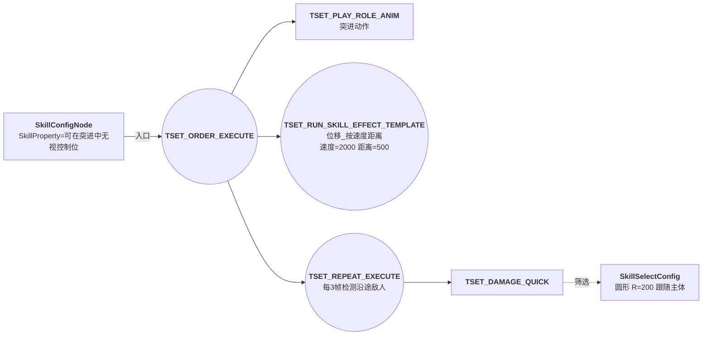

### 节点参数表

| 节点 | 参数要点 |
|------|----------|
| `SkillConfigNode` | `SkillProperty` 配位组（无视眩晕/无视减速等） |
| 位移模板 | 速度（每帧像素）/ 距离 / 是否碰撞中断 / 中断后是否触发 |
| `TSET_REPEAT_EXECUTE` | `Params=[3, 5, 1立即, <Damage ID>, <筛选 ID>, 0, 0, 0, 0, 1]` 每 3 帧打 5 次 |

**易错**：
- 位移期间默认会被控制打断，必须开 `SkillProperty` 的"无视禁止施法位"
- 沿途伤害用 `TSET_REPEAT_EXECUTE` 而不是单帧筛选，否则会漏判
- 突进碰撞墙体后位置必须截断，由位移模板内部处理

---

## 原型 6：自身增益 Buff

**典型场景**：使用技能后给自己加 8 秒攻速 buff。

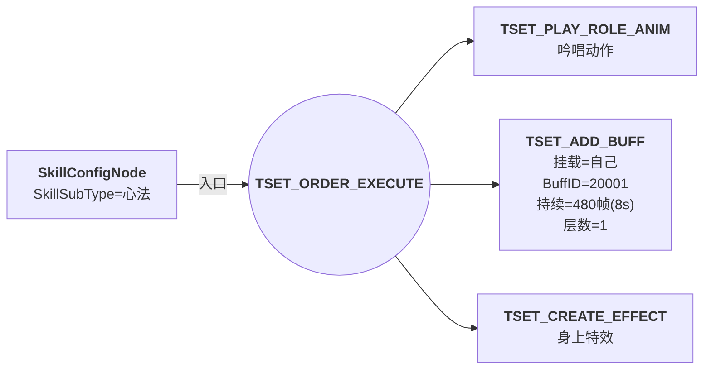

### 节点参数表

| 节点 | 参数要点 |
|------|----------|
| `TSET_ADD_BUFF` | `Params=[{V:1,PT:5,即主体单位}挂载, {V:1,PT:5,即主体单位}来源, <BuffID>, 480帧, 0间隔, 1层数, 1急速影响]` |

**易错**：
- 8 秒 = 480 帧（60fps）
- BuffConfig 里要单独配属性变化（不在 SkillEffectConfig 里）
- 持续型 buff 间隔填 0；周期型 buff 间隔填触发频率

---

## 原型 7：周期持续效果（旋风 / 灼烧 / 火环）

**典型场景**：身边创建一个持续 6 秒的旋风，每 0.5 秒造成一次伤害。

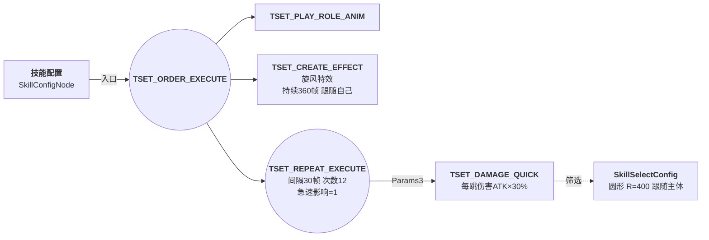

### 节点参数表

| 节点 | 参数要点 |
|------|----------|
| `TSET_REPEAT_EXECUTE` | `Params=[间隔=30, 次数=12, 立即=1, <Damage ID>, <筛选 ID>, 0中断, 0死亡停, 0结束, 0战斗结束停, 1急速]` |
| `TSET_CREATE_EFFECT` 旋风特效 | `Params[4]=360帧持续`, `Params[5]={V:1,PT:5,即主体单位}跟随主体` |

**易错**：
- 持续时长（特效 360 帧 vs Repeat 12×30=360 帧）必须严格对齐
- 想"死亡时停止"开 `Params[6]=1`
- 想 buff 模式可以代替 REPEAT，但 buff 不能直接打不同筛选

---

## 原型 8：召唤分身 / 守卫（参考 30312004 木傀）

**典型场景**：召唤一个分身在身边攻击敌人，持续 10 秒。

**关键技巧**：用模板 `66001175【模板】召唤分身单位.json` 或 `32004137_【模板】召唤分身（通用）`。

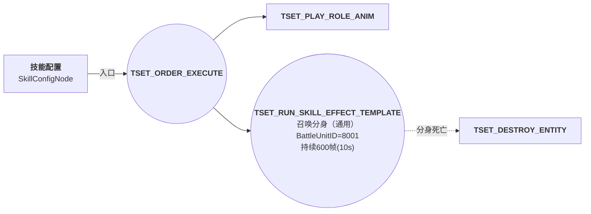

### 节点参数表

| 节点 | 参数要点 |
|------|----------|
| 召唤分身模板 | `Params=[<BattleUnitConfigID>, 阵营, 玩家索引, 出生前效果, 出生后效果, 持续帧, ...]` |

**易错**：
- 分身的属性是**继承主体**还是用 BattleUnitConfig 默认值？看模板里有没有"属性继承"模板（`1860214【模板】属性继承.json`）
- 分身死亡触发：通过监听 buff 到期或显式 DESTROY_ENTITY
- 召唤数量上限：通过 SkillTagsConfig 计数实现

---

## 原型 9：命中事件触发（连锁反应）

**典型场景**：技能命中敌人时，对该敌人额外造成 10% 伤害（命中后追加效果）。

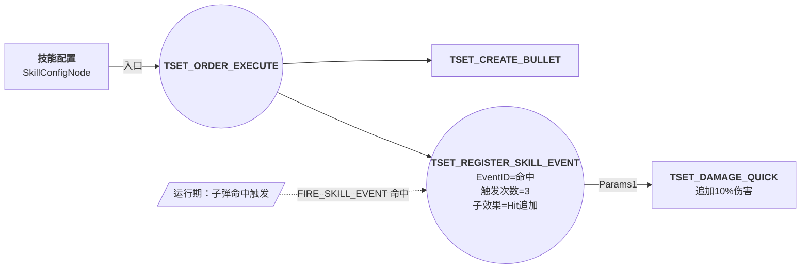

### 节点参数表

| 节点 | 参数要点 |
|------|----------|
| `TSET_REGISTER_SKILL_EVENT` | `Params=[<SkillEventID 命中>, <Hit ID>, 0当前技能, 0筛选, 0条件, 3次数, 0阵营, 0, 0, 0事件子类型, 0值]` |
| `TSET_UNREGISTER_SKILL_EVENT` | 在技能结束时配套反注册（避免泄漏） |

**易错**：
- 注册事件**必须**配套反注册（在技能结束效果里）
- 触发次数限制：填 0 = 无限（除非真的需要无限触发）
- 事件 ID 来自 `SkillEventConfig` 表，需要先建好对应的 Event

---

## 原型 10：Switch 分支（按 Tag 切换形态）

**典型场景**：按当前角色的"五行模式"Tag 切换不同子弹效果。

参考 30122001 的子弹切换逻辑：

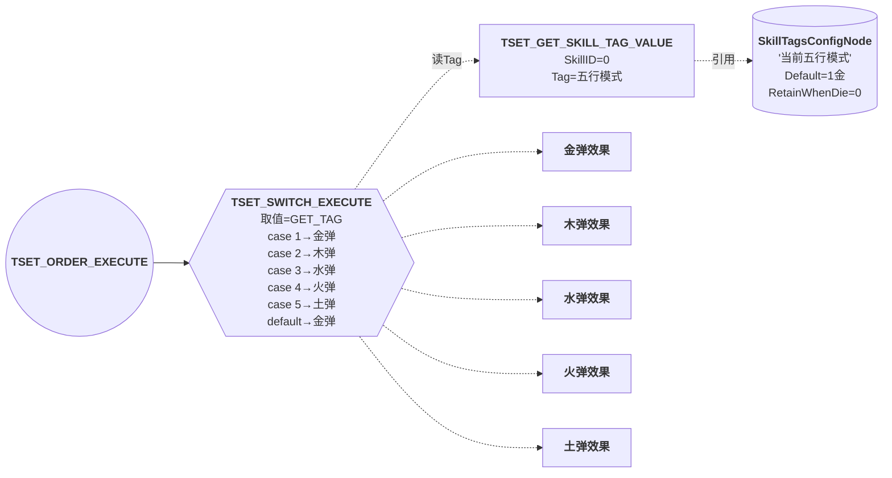

### 节点参数表

| 节点 | 参数要点 |
|------|----------|
| `TSET_SWITCH_EXECUTE` | `Params=[{V:<GetTagID>,PT:2}, <默认效果>, 1,<金弹>, 2,<木弹>, 3,<水弹>, 4,<火弹>, 5,<土弹>]`（最多 10 组 case） |
| `TSET_GET_SKILL_TAG_VALUE` | `Params=[{V:<拥有者>,PT:5}, 0=当前技能, <TagID>, 1, 1取最终值]` |
| `SkillTagsConfigNode` | `Desc='当前五行模式'`, `Default=1`, `RetainWhenDie=0` |

**易错**：
- Switch 取值参数 `ParamType=2` 表示"Value 是别的 SkillEffectConfig 的输出"
- case 顺序无所谓，但**默认必须填**否则未匹配时报错
- 同一个 Switch 不能超过 10 个 case，多了拆套娃 Switch

---

## 原型 11：模板调用复用

**典型场景**：复用通用伤害流程（伤害减免、化解、暴击、闪避、命中触发）。

**关键技巧**：用 `175000212【模板】通用伤害流程.json`，传入"主体/目标/伤害值/伤害类型"等参数即可。

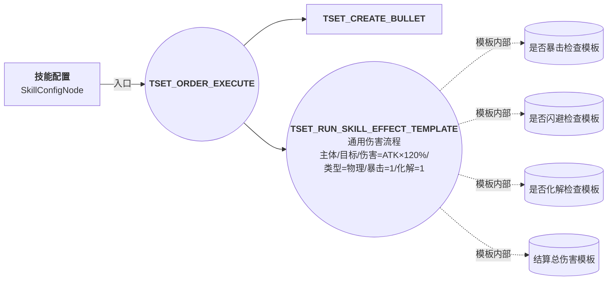

### 节点参数表

| 节点 | 参数要点 |
|------|----------|
| `TSET_RUN_SKILL_EFFECT_TEMPLATE` 通用伤害 | 模板路径 = `技能模板/伤害/175000212【模板】通用伤害流程.json`，`Params=[{V:1,PT:5,即主体单位}主体, {V:2,PT:5,即目标单位}目标, <伤害值>, <类型>, <暴击 0/1>, <化解 0/1>, <闪避 0/1>, ...]` |

**易错**：
- 模板的 `TemplateData.TemplateParams` 必须**全部填**，少一个参数就会用默认值（可能导致意外行为）
- 模板的 `TemplatePath` 路径要严格相对于工程根
- 模板嵌套不要超过 3 层（性能、可维护性问题）

---

## 通用约定与最佳实践

### 1. ID 段位规约

新建技能效果时，建议遵循以下命名段：
- 主线效果：`32_xxx_xxx`（与技能 ID 弱关联）
- 子弹效果：`32004xxx`
- 事件触发追加效果：`32008xxx`
- 调试/测试效果：`9999xxxx`

### 2. 必备主节点

**任何技能蓝图**至少要有：
- 1 个 `SkillConfigNode`
- 1 个 入口 `TSET_ORDER_EXECUTE`（推荐挂在 `SkillEffectExecuteInfo.SkillEffectConfigID`）
- 0~多个 `SkillTagsConfigNode`（看是否需要参数）

### 3. 帧数换算

- `60fps` 假设
- `1 秒 = 60 帧`
- `200ms = 12 帧`
- `8 秒 = 480 帧`
- `急速影响=1` 时实际帧数 = 配置帧数 × (1 / 急速倍率)

### 4. 阵营约定

- `SpecialSkillSelectFlag` = `TSSSF_Common_DiJun` 敌军（默认）/ `TSSSF_Common_YouJun` 友军 / `TSSSF_None` 无过滤
- 友军治疗/buff：必须改 `TSSSF_Common_YouJun`，**默认是敌军会失效**

### 5. 子弹/特效的"急速影响"

- 默认开启（值=1），子弹会受攻速属性影响
- 关闭（值=0）适用于"非战斗类"特效（如纯视觉的施法环）

### 6. 调试技巧

- 用 `TSET_DEBUG_LOG`（4 个 int 入参）打印关键变量
- 复杂分支前后插入 LOG 节点逐步排查
- 在 SkillTagsConfig 上配 `Desc` 时尽量写清楚，方便后续查找

---

## 何时该新建模板

如果一段流程在 ≥3 个技能中重复出现，应该抽取为模板：
1. 在 `Saves/Jsons/技能模板/<分类>/` 新建 `SkillGraph_<ID>【模板】<名称>.json`
2. 模板内的根节点设 `IsTemplate=true`
3. 在 `TemplateParams` 声明所有外部传入参数（带类型注解）
4. 业务侧用 `TSET_RUN_SKILL_EFFECT_TEMPLATE` 调用即可

---

## 交叉引用

- [[技能编辑器架构]] — 整体架构、JSON 结构、节点拓扑
- [[技能节点字典]] — 每个节点的字段语义详解
- [[xNode节点编辑器]] — 底层框架

## 源码引用

- 真实样本（用户业务范围）：[{{SKILLGRAPH_JSONS_ROOT}}宗门技能/](../../{{SKILLGRAPH_JSONS_ROOT}}宗门技能/)
- 通用模板库：[{{SKILLGRAPH_JSONS_ROOT}}技能模板/](../../{{SKILLGRAPH_JSONS_ROOT}}技能模板/)
- 解析示例（30122001 坠叶三叠完整剖析）：见 [[技能蓝图模板库#原型 2：多段连招]]

## 待确认 / 疑问

- 11 个原型覆盖宗门技能的多数典型用法，但仍有少量复杂技能（如 30531000 传承心法 1.1MB、30214001 火宗门 443KB）未直接展开样本
- 阵型节点 `TSET_LAYOUT_SUMMON_BULLET` 的 Params 顺序和形状枚举值需查 CSV 确认
- 模板嵌套的运行时性能影响（模板展开是否缓存？）
