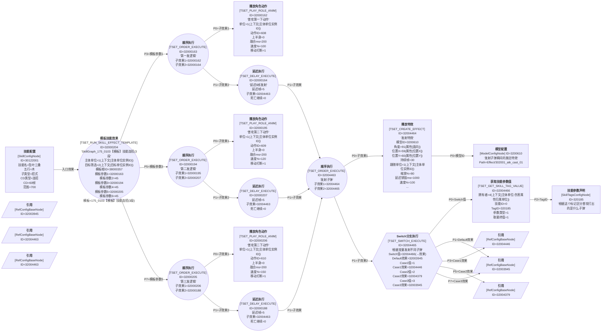

# 技能蓝图：SkillGraph_30122001【木宗门】坠叶三叠

## 技能基本信息

| 字段 | 值 |
|------|----|
| 技能 ID | 30122001 |
| 中文名 | 坠叶三叠 |
| 描述 | 坠叶三叠。 |
| 五行 | 木 |
| 主类型 | 功法技 |
| 子类型 | 招式 |
| CD 类型 | 连招 |
| CD 帧 | 60 |
| 施法范围 | 700 |
| AI 范围 | 700 |
| 心法能量 | 10 |
| 品质 | 3 |
| Icon | Skill/Pugong/PuGong_mu |
| **主动入口 SkillEffectConfigID** | **32000204** |
| 连招 CD 列表 | (20帧, BaseDur=9, Buffer=9), (20帧, BaseDur=9, Buffer=9), (20帧, BaseDur=9, Buffer=9) |
| SkillTagsList | Tag 335=800 |

## Mermaid 蓝图

## 节点详细参数表

| rid | 中文名 | 类名 | ID | Desc | 关键字段 / Params |
|-----|--------|------|----|------|--------------------|
| 1000 | **技能配置** | SkillConfigNode | 30122001 |  | 五行=木 主类型=功法技 子类型=招式 CD类型=连招 CD=60 范围=700 AI范围=700 入口效果ID=32000204 |
| 1001 | **播放角色动作** | TSET_PLAY_ROLE_ANIM | 32000162 | 普攻第一下动作 | 单位=1(上下文[主体单位实例ID]) 动作ID=608 上半身=0 融合ms=200 速度%=100 移动打断=1 急速=0 仅指定可见=0 帧数=0 音效绑定=0 |
| 1002 | **顺序执行** | TSET_ORDER_EXECUTE | 32000194 | 第二发逻辑 | 子效果1=32000195 子效果2=32000207 |
| 1003 | **播放角色动作** | TSET_PLAY_ROLE_ANIM | 32000195 | 普攻第二下动作 | 单位=1(上下文[主体单位实例ID]) 动作ID=609 上半身=0 融合ms=200 速度%=120 移动打断=1 急速=0 仅指定可见=0 帧数=0 音效绑定=0 |
| 1004 | **顺序执行** | TSET_ORDER_EXECUTE | 32000205 | 第三发逻辑 | 子效果1=32000206 子效果2=32000188 |
| 1005 | **播放角色动作** | TSET_PLAY_ROLE_ANIM | 32000206 | 普攻第二下动作 | 单位=1(上下文[主体单位实例ID]) 动作ID=610 上半身=0 融合ms=200 速度%=150 移动打断=1 急速=0 仅指定可见=0 帧数=0 音效绑定=0 |
| 1006 | **顺序执行** | TSET_ORDER_EXECUTE | 32000163 | 第一发逻辑 | 子效果1=32000162 子效果2=32000164 |
| 1007 | **延迟执行** | TSET_DELAY_EXECUTE | 32000164 | 延迟5帧发射 | 延迟帧=5 子效果=32004463 死亡继续=0 筛选ID=0 中断ID=0 _保留=0 急速影响=0 |
| 1008 | **模板技能效果** | TSET_RUN_SKILL_EFFECT_TEMPLATE | 32000204 | SkillGraph_175_0103【模板】技能连招(3段).json | 主体单位=1(上下文[主体单位实例ID]) 目标筛选=2(上下文[目标单位实例ID]) 模板根ID=38000357 模板参数1=32000163 模板参数2=45 模板参数3=32000194 模板参数4=45 模板参数5=32000205 模板参数6=45 模板=SkillGraph_175_0103【模板】技能连招(3段).json |
| 1009 | **延迟执行** | TSET_DELAY_EXECUTE | 32000188 |  | 延迟帧=5 子效果=32004463 死亡继续=0 筛选ID=0 中断ID=0 _保留=0 急速影响=0 |
| 1010 | **延迟执行** | TSET_DELAY_EXECUTE | 32000207 |  | 延迟帧=5 子效果=32004463 死亡继续=0 筛选ID=0 中断ID=0 _保留=0 急速影响=0 |
| 1011 | **技能参数声明** | SkillTagsConfigNode | 320185 | 根据这个标记区分普攻打出的是什么子弹 | Default=0 RetainWhenDie=False TagType=- |
| 1012 | **顺序执行** | TSET_ORDER_EXECUTE | 32004463 | 发射子弹 | 子效果1=32004464 子效果2=32004465 |
| 1013 | **播放特效** | TSET_CREATE_EFFECT | 32004464 | 发射特效 | 模型ID=3200610 角度=91(属性[面向]) 位置X=59(属性[位置X]) 位置Y=60(属性[位置Y]) 持续帧=30 跟随单位=1(上下文[主体单位实例ID]) 缩放%=80 延迟销毁ms=1000 偏移X=0 速度%=100 偏移Y=0 单位组=0 Z=50 特效类型=0 _=150 出生后效果=0 急速=1 |
| 1014 | **模型配置** | ModelConfigNode | 3200610 | 发射子弹瞬间的施法特效 | ModelPath=Effect/302001_atk_cast_01 |
| 1015 | **Switch分支执行** | TSET_SWITCH_EXECUTE | 32004465 | 根据变量发射不同子弹 | Switch值=32004466(→效果) Default效果=32003945 Case1值=1 Case1效果=32004446 Case2值=2 Case2效果=32004379 Case3值=3 Case3效果=32003945 |
| 1016 | **获取技能参数值** | TSET_GET_SKILL_TAG_VALUE | 32004466 |  | 拥有者=4(上下文[主体单位-伤害属性归属单位]) 技能ID=0 TagID=320185 参数类型=1 取最终值=1 |
| 1017 | **引用** | RefConfigBaseNode | 32003945 |  | 引用 TableDR.SkillEffectConfigManager ID=32003945 |
| 1018 | **引用** | RefConfigBaseNode | 32004446 |  | 引用 TableDR.SkillEffectConfigManager ID=32004446 |
| 1019 | **引用** | RefConfigBaseNode | 32004379 |  | 引用 TableDR.SkillEffectConfigManager ID=32004379 |
| 1020 | **引用** | RefConfigBaseNode | 32003945 |  | 引用 TableDR.SkillEffectConfigManager ID=32003945 |
| 1021 | **引用** | RefConfigBaseNode | 32004463 |  | 引用 TableDR.SkillEffectConfigManager ID=32004463 |
| 1022 | **引用** | RefConfigBaseNode | 32004463 |  | 引用 TableDR.SkillEffectConfigManager ID=32004463 |