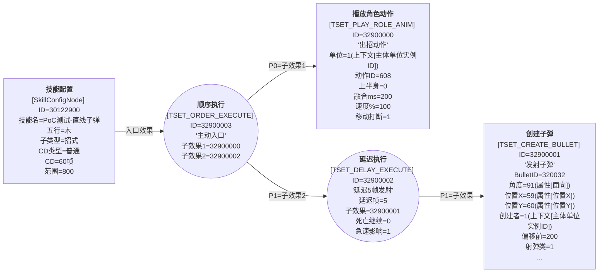

# 技能蓝图：SkillGraph_30122900_PoC测试-直线子弹

## 技能基本信息

| 字段 | 值 |
|------|----|
| 技能 ID | 30122900 |
| 中文名 | PoC测试-直线子弹 |
| 描述 | PoC 测试技能。 |
| 五行 | 木 |
| 主类型 | 功法技 |
| 子类型 | 招式 |
| CD 类型 | 普通 |
| CD 帧 | 60 |
| 施法范围 | 800 |
| AI 范围 | 800 |
| 缓冲区时长 | 20 |
| 基础时长 | 20 |
| 心法能量 | 5 |
| 品质 | 3 |
| Icon | Skill/Pugong/PuGong_mu |
| **主动入口 SkillEffectConfigID** | **32900003** |

## Mermaid 蓝图

## 节点详细参数表

| rid | 中文名 | 类名 | ID | Desc | 关键字段 / Params |
|-----|--------|------|----|------|--------------------|
| 1000 | **技能配置** | SkillConfigNode | 30122900 |  | 五行=木 主类型=功法技 子类型=招式 CD类型=普通 CD=60 范围=800 AI范围=800 入口效果ID=32900003 |
| 1001 | **顺序执行** | TSET_ORDER_EXECUTE | 32900003 | 主动入口 | 子效果1=32900000 子效果2=32900002 |
| 1002 | **播放角色动作** | TSET_PLAY_ROLE_ANIM | 32900000 | 出招动作 | 单位=1(上下文[主体单位实例ID]) 动作ID=608 上半身=0 融合ms=200 速度%=100 移动打断=1 急速=0 仅指定可见=0 帧数=0 音效绑定=0 |
| 1003 | **延迟执行** | TSET_DELAY_EXECUTE | 32900002 | 延迟5帧发射 | 延迟帧=5 子效果=32900001 死亡继续=0 筛选ID=0 中断ID=0 _保留=0 急速影响=1 |
| 1004 | **创建子弹** | TSET_CREATE_BULLET | 32900001 | 发射子弹 | BulletID=320032 角度=91(属性[面向]) 位置X=59(属性[位置X]) 位置Y=60(属性[位置Y]) 创建者=1(上下文[主体单位实例ID]) 偏移右=0 偏移前=200 子子弹=0 单位组=0 射弹类=1 初始技能=0 自定义模型=0 Z高度=0 仰角=0 急速=0 |