# 技能蓝图：SkillGraph_30222005【木宗门】奇术_地阶_青岚劲

## 技能基本信息

| 字段 | 值 |
|------|----|
| 技能 ID | 30222005 |
| 中文名 | 青岚劲 |
| 描述 | 青岚劲。 |
| 五行 | 木 |
| 主类型 | 功法技 |
| 子类型 | 奇术 |
| CD 类型 | 充能 |
| CD 帧 | 180 |
| 施法范围 | 1200 |
| AI 范围 | 1200 |
| 前摇帧 | 15 |
| 缓冲区时长 | 20 |
| 基础时长 | 20 |
| 品质 | 3 |
| Icon | Skill/GongFa/Mu/skill_mu_302001 |
| **主动入口 SkillEffectConfigID** | **32000552** |
| 被动入口 SkillEffectConfigID | 32002898 |

## Mermaid 蓝图

```mermaid
flowchart LR
  N1000["<b>技能配置</b><br/>[SkillConfigNode] ID=30222005<br/>技能名=青岚劲<br/>五行=木<br/>子类型=奇术<br/>CD类型=充能<br/>CD=180帧<br/>范围=1200"]
  N1001["<b>播放特效</b><br/>[TSET_CREATE_EFFECT] ID=32000505<br/>'蓄力特效'<br/>模型ID=3200084<br/>角度=91(属性[面向])<br/>位置X=59(属性[位置X])<br/>位置Y=60(属性[位置Y])<br/>持续帧=90<br/>跟随单位=1(上下文[主体单位实例ID])<br/>缩放%=100<br/>延迟销毁ms=1000<br/>速度%=100<br/>..."]
  N1002["<b>模型配置</b><br/>[ModelConfigNode] ID=3200084<br/>'预警特效'<br/>Path=Effect/30222005_mu_cast1"]
  N1003(("<b>顺序执行</b><br/>[TSET_ORDER_EXECUTE] ID=32000552<br/>子效果1=32001806<br/>子效果2=32002413<br/>子效果3=32000553"))
  N1004["<b>播放角色动作</b><br/>[TSET_PLAY_ROLE_ANIM] ID=32000553<br/>'播放施法动作'<br/>单位=75(属性[实体实例ID])<br/>动作ID=566<br/>上半身=0<br/>融合ms=200<br/>速度%=250<br/>移动打断=1<br/>急速=1"]
  N1005["<b>创建子弹</b><br/>[TSET_CREATE_BULLET] ID=32000557<br/>'创建发射子弹'<br/>BulletID=320032<br/>角度=91(属性[面向])<br/>位置X=59(属性[位置X])<br/>位置Y=60(属性[位置Y])<br/>创建者=1(上下文[主体单位实例ID])<br/>偏移前=200<br/>射弹类=1<br/>..."]
  N1006["<b>子弹配置</b><br/>[BulletConfigNode] ID=320032<br/>'子弹属性'"]
  N1007["<b>模型配置</b><br/>[ModelConfigNode] ID=3200086<br/>'飞行的子弹特效'<br/>Path=Effect/30222005_mu_fly"]
  N1008(("<b>模板技能效果</b><br/>[TSET_RUN_SKILL_EFFECT_TEMPLATE] ID=32000568<br/>'SkillGraph_【模板】子弹通用逻辑-碰撞.json'<br/>主体单位=1(上下文[主体单位实例ID])<br/>目标筛选=2(上下文[目标单位实例ID])<br/>模板根ID=190016404<br/>模板参数1=32000569<br/>模板参数2=1<br/>模板参数3=400<br/>模板参数4=360<br/>模板参数7=50<br/>...<br/>模板=【模板】子弹通用逻辑-碰撞"))
  N1009(("<b>顺序执行</b><br/>[TSET_ORDER_EXECUTE] ID=32000569<br/>子效果1=32002138<br/>子效果2=32001218<br/>子效果3=32002160"))
  N1010(("<b>模板技能效果</b><br/>[TSET_RUN_SKILL_EFFECT_TEMPLATE] ID=32000574<br/>'SkillGraph_【模板】子弹通用逻辑-伤害.json'<br/>主体单位=1(上下文[主体单位实例ID])<br/>目标筛选=2(上下文[目标单位实例ID])<br/>模板根ID=190016485<br/>模板参数1=1<br/>模板参数2=6(上下文[施法者-伤害属性归属单位])<br/>模板参数4=2<br/>模板参数5=16<br/>模板参数6=-1<br/>模板参数7=-1<br/>...<br/>模板=【模板】子弹通用逻辑-伤害"))
  N1011(("<b>顺序执行</b><br/>[TSET_ORDER_EXECUTE] ID=32002162<br/>子效果1=32000574<br/>子效果2=32000575"))
  N1012(("<b>模板技能效果</b><br/>[TSET_RUN_SKILL_EFFECT_TEMPLATE] ID=32000575<br/>'SkillGraph_【模板】子弹通用逻辑-表现.json'<br/>主体单位=1(上下文[主体单位实例ID])<br/>目标筛选=2(上下文[目标单位实例ID])<br/>模板根ID=190016523<br/>模板参数3=3200088<br/>模板参数4=2<br/>模板参数5=100<br/>模板参数6=2<br/>...<br/>模板=【模板】子弹通用逻辑-表现"))
  N1013["<b>模型配置</b><br/>[ModelConfigNode] ID=3200088<br/>Path=Effect/demo_skill7_hit"]
  N1014(("<b>顺序执行</b><br/>[TSET_ORDER_EXECUTE] ID=32000604<br/>子效果1=32000557"))
  N1015["<b>镜头抖动</b><br/>[TSET_CAMERA_SHAKE] ID=32001984<br/>'引爆瞬间震屏'<br/>执行单位=35(上下文[施法者-根创建者实例ID])<br/>对谁生效=1<br/>起效半径=800<br/>ShakeID=11<br/>优先级=1"]
  N1016{{"<b>条件执行</b><br/>[TSET_CONDITION_EXECUTE] ID=32001218<br/>'根据击中的敌人是否有中毒buff决定是否毒爆'<br/>条件ID=320078<br/>满足效果=32001980<br/>不满足效果=0"}}
  N1017["<b>是否拥有BUFF</b><br/>[TSCT_HAS_BUFF] ID=320078<br/>'如果对方身上有中毒buff'<br/>P0=2(上下文[目标单位实例ID])<br/>P1=10008<br/>P2=0"]
  N1018["<b>技能参数声明</b><br/>[SkillTagsConfigNode] ID=320033<br/>'吟唱时长'<br/>Default=20"]
  N1019["<b>获取技能参数值</b><br/>[TSET_GET_SKILL_TAG_VALUE] ID=32001480<br/>'获取吟唱总时长'<br/>拥有者=4(上下文[主体单位-伤害属性归属单位])<br/>技能ID=41(上下文[初始技能实例ID])<br/>TagID=320033<br/>参数类型=1<br/>取最终值=1"]
  N1020["<b>数值运算</b><br/>[TSET_NUM_CALCULATE] ID=32001478<br/>'每25%攻速带来一次20%（6帧）吟唱缩减'<br/>初始值=32001479(→效果)<br/>运算符1=6<br/>数值1=2500<br/>运算符2=5<br/>数值2=6"]
  N1021["<b>模型配置</b><br/>[ModelConfigNode] ID=3200258<br/>'毒爆特效'<br/>Path=Effect/30222008_mu_boom"]
  N1022["<b>获取单位属性</b><br/>[TSET_GET_ENTITY_ATTR_VALUE] ID=32001479<br/>'获取攻速增益万分比'<br/>P0=1(上下文[主体单位实例ID])<br/>P1=175"]
  N1023["<b>数值运算</b><br/>[TSET_NUM_CALCULATE] ID=32001324<br/>'获取播放速度倍率'<br/>初始值=30<br/>运算符1=5<br/>数值1=100<br/>运算符2=6<br/>数值2=32001481(→效果)"]
  N1024["<b>数值运算</b><br/>[TSET_NUM_CALCULATE] ID=32001481<br/>'获取吟唱时长'<br/>初始值=32001480(→效果)<br/>运算符1=4<br/>数值1=32001478(→效果)"]
  N1025[/"<b>引用</b><br/>[RefConfigBaseNode] ID=32001481"/]
  N1026(("<b>延迟执行</b><br/>[TSET_DELAY_EXECUTE] ID=32001806<br/>'延迟发射'<br/>延迟帧=24(上下文[初始技能攻击触发帧])<br/>子效果=32000604<br/>死亡继续=0<br/>急速影响=1"))
  N1027(("<b>顺序执行</b><br/>[TSET_ORDER_EXECUTE] ID=32001968<br/>子效果1=32001974<br/>子效果2=32001975"))
  N1028(("<b>模板技能效果</b><br/>[TSET_RUN_SKILL_EFFECT_TEMPLATE] ID=32001974<br/>'SkillGraph_【模板】子弹通用逻辑-伤害.json'<br/>主体单位=1(上下文[主体单位实例ID])<br/>目标筛选=2(上下文[目标单位实例ID])<br/>模板根ID=190016485<br/>模板参数1=1<br/>模板参数2=6(上下文[施法者-伤害属性归属单位])<br/>模板参数4=2<br/>模板参数5=32<br/>模板参数6=32002464(→效果)<br/>模板参数7=-1<br/>...<br/>模板=【模板】子弹通用逻辑-伤害"))
  N1029(("<b>模板技能效果</b><br/>[TSET_RUN_SKILL_EFFECT_TEMPLATE] ID=32001975<br/>'SkillGraph_【模板】子弹通用逻辑-表现.json'<br/>主体单位=1(上下文[主体单位实例ID])<br/>目标筛选=2(上下文[目标单位实例ID])<br/>模板根ID=190016523<br/>模板参数3=3200258<br/>模板参数4=1<br/>模板参数5=100<br/>...<br/>模板=【模板】子弹通用逻辑-表现"))
  N1030(("<b>顺序执行</b><br/>[TSET_ORDER_EXECUTE] ID=32001980<br/>子效果1=32002435<br/>子效果2=32001984<br/>子效果3=32001968<br/>子效果4=32002436"))
  N1031["<b>技能参数声明</b><br/>[SkillTagsConfigNode] ID=320095<br/>'毒爆扩散范围'<br/>Default=500"]
  N1032["<b>播放音效</b><br/>[TSET_PLAY_SOUND] ID=32002413<br/>VoiceID=4(上下文[主体单位-伤害属性归属单位])<br/>类型=42054<br/>单位音效配置=1<br/>P4=6<br/>P5=1(上下文[主体单位实例ID])<br/>P8=1<br/>..."]
  N1033["<b>播放音效</b><br/>[TSET_PLAY_SOUND] ID=32002435<br/>VoiceID=4(上下文[主体单位-伤害属性归属单位])<br/>类型=42055<br/>单位音效配置=1<br/>P4=6<br/>P5=1(上下文[主体单位实例ID])<br/>P8=1<br/>..."]
  N1034["<b>移除buff</b><br/>[TSET_REMOVE_BUFF] ID=32002436<br/>目标=2(上下文[目标单位实例ID])<br/>移除方式=0<br/>ID或类型=10008"]
  N1035["<b>数值运算</b><br/>[TSET_NUM_CALCULATE] ID=32002464<br/>'计算毒爆威力系数'<br/>初始值=280<br/>运算符1=5<br/>数值1=32002109(→效果)<br/>运算符2=5<br/>数值2=32002114(→效果)"]
  N1036["<b>技能CD设置-减少CD</b><br/>[TSET_SET_SKILLCD_REDUCE] ID=32002147<br/>'当前技能减少80%CD'<br/>P0=35(上下文[施法者-根创建者实例ID])<br/>P1=32002154(→效果)<br/>P2=32002159(→效果)"]
  N1037["<b>获取技能槽位类型</b><br/>[TSET_GET_SKILL_SLOT_TYPE] ID=32002154<br/>'获得当前技能槽'<br/>P0=41(上下文[初始技能实例ID])<br/>P1=0"]
  N1038["<b>注册技能消息</b><br/>[TSET_REGISTER_SKILL_EVENT] ID=32002876<br/>EventID=11<br/>绑定效果=32002871<br/>绑定技能=0<br/>条件=320389<br/>次数=-1<br/>目标阵营=2<br/>..."]
  N1039["<b>获取技能槽位类型</b><br/>[TSET_GET_SKILL_SLOT_TYPE] ID=32002158<br/>'获得当前技能槽'<br/>P0=41(上下文[初始技能实例ID])<br/>P1=0"]
  N1040["<b>技能CD设置-减少CD</b><br/>[TSET_SET_SKILLCD_REDUCE] ID=32002871<br/>'当前技能减少60%CD'<br/>P0=35(上下文[施法者-根创建者实例ID])<br/>P1=32002872(→效果)<br/>P2=32002875(→效果)"]
  N1041["<b>获取技能槽位类型</b><br/>[TSET_GET_SKILL_SLOT_TYPE] ID=32002872<br/>'获得当前技能槽'<br/>P0=41(上下文[初始技能实例ID])<br/>P1=0"]
  N1042["<b>数值运算</b><br/>[TSET_NUM_CALCULATE] ID=32002875<br/>初始值=32002874(→效果)<br/>运算符1=5<br/>数值1=32002880(→效果)<br/>运算符2=6<br/>数值2=10000"]
  N1043["<b>获取技能CD</b><br/>[TSET_GET_SKILLCD] ID=32002156<br/>'获取当前技能CD'<br/>P0=35(上下文[施法者-根创建者实例ID])<br/>P1=32002158(→效果)<br/>P2=2"]
  N1044["<b>条件与</b><br/>[TSCT_AND] ID=320389<br/>P0=320396<br/>P1=320398<br/>P2=320399<br/>P3=320400"]
  N1045["<b>获取技能CD</b><br/>[TSET_GET_SKILLCD] ID=32002874<br/>'获取当前技能CD'<br/>P0=35(上下文[施法者-根创建者实例ID])<br/>P1=32002873(→效果)<br/>P2=2"]
  N1046["<b>数值运算</b><br/>[TSET_NUM_CALCULATE] ID=32002159<br/>初始值=32002156(→效果)<br/>运算符1=5<br/>数值1=8<br/>运算符2=6<br/>数值2=10"]
  N1047["<b>获取技能槽位类型</b><br/>[TSET_GET_SKILL_SLOT_TYPE] ID=32002873<br/>'获得当前技能槽'<br/>P0=41(上下文[初始技能实例ID])<br/>P1=0"]
  N1048(("<b>延迟执行</b><br/>[TSET_DELAY_EXECUTE] ID=32002160<br/>延迟帧=1<br/>子效果=32002162<br/>死亡继续=0<br/>急速影响=1"))
  N1049["<b>注册技能消息</b><br/>[TSET_REGISTER_SKILL_EVENT] ID=32002178<br/>EventID=1<br/>绑定效果=32002147<br/>绑定技能=0<br/>条件=320231<br/>次数=-1<br/>事件子类型=16<br/>..."]
  N1050["<b>条件与</b><br/>[TSCT_AND] ID=320231<br/>P0=320242<br/>P1=320233<br/>P2=320234"]
  N1051["<b>数值判断</b><br/>[TSCT_VALUE_COMPARE] ID=320234<br/>'击杀技能ID是自身'<br/>P0=3(事件参数)<br/>P1=1<br/>P2=7(上下文[初始技能ID])"]
  N1052["<b>数值判断</b><br/>[TSCT_VALUE_COMPARE] ID=320233<br/>'击杀者是施法者'<br/>P0=2(事件参数)<br/>P1=1<br/>P2=35(上下文[施法者-根创建者实例ID])"]
  N1053["<b>数值判断</b><br/>[TSCT_VALUE_COMPARE] ID=320232<br/>'死亡的是击中的人'<br/>P0=1(事件参数)<br/>P1=1<br/>P2=1001(→技能参数)"]
  N1054["<b>是否拥有BUFF</b><br/>[TSCT_HAS_BUFF] ID=320238<br/>P0=1001(→技能参数)<br/>P1=10008<br/>P2=0"]
  N1055["<b>恒真</b><br/>[TSCT_TRUE] ID=320245<br/>P0=32002237"]
  N1056["<b>打印调试日志</b><br/>[TSET_LOG_INFO] ID=32002237<br/>P0=32002240(→效果)<br/>P1=0<br/>P2=0"]
  N1057["<b>获取单位属性</b><br/>[TSET_GET_ENTITY_ATTR_VALUE] ID=32002240<br/>P0=1(事件参数)<br/>P1=89"]
  N1058["<b>技能参数声明</b><br/>[SkillTagsConfigNode] ID=320109<br/>'是否中毒'"]
  N1059{{"<b>条件执行</b><br/>[TSET_CONDITION_EXECUTE] ID=32002138<br/>条件ID=320237<br/>满足效果=32002150<br/>不满足效果=0"}}
  N1060["<b>是否拥有BUFF</b><br/>[TSCT_HAS_BUFF] ID=320237<br/>'被击中者身上是否有中毒buff'<br/>P0=2(上下文[目标单位实例ID])<br/>P1=10008<br/>P2=0"]
  N1061["<b>修改技能参数值</b><br/>[TSET_MODIFY_SKILL_TAG_VALUE] ID=32002150<br/>'把它身上的标记设为生前中毒'<br/>拥有者=2(上下文[目标单位实例ID])<br/>技能ID=41(上下文[初始技能实例ID])<br/>TagID=320109<br/>值=1<br/>参数类型=1"]
  N1062["<b>数值判断</b><br/>[TSCT_VALUE_COMPARE] ID=320242<br/>'如果标记为1'<br/>P0=32002155(→效果)<br/>P1=1<br/>P2=1"]
  N1063["<b>获取技能参数值</b><br/>[TSET_GET_SKILL_TAG_VALUE] ID=32002155<br/>'获取死亡者是否中毒标记'<br/>拥有者=1(事件参数)<br/>技能ID=41(上下文[初始技能实例ID])<br/>TagID=320109<br/>参数类型=1<br/>取最终值=1"]
  N1064["<b>获取BUFF层数</b><br/>[TSET_GET_BUFF_LAYER_COUNT] ID=32002109<br/>'获取目标身上中毒层数'<br/>P0=2(上下文[目标单位实例ID])<br/>P1=0<br/>P2=10008"]
  N1065["<b>获取Buff时间相关</b><br/>[TSET_GET_BUFF_TIME] ID=32002114<br/>'获取buff剩余次数'<br/>P0=2(上下文[目标单位实例ID])<br/>P1=10008<br/>P2=3"]
  N1066["<b>技能参数声明</b><br/>[SkillTagsConfigNode] ID=320142<br/>'是否被蓄返术强化'"]
  N1067["<b>技能参数声明</b><br/>[SkillTagsConfigNode] ID=320143<br/>'蓄返术返还CD万分比'"]
  N1068{{"<b>条件执行</b><br/>[TSET_CONDITION_EXECUTE] ID=32002866<br/>条件ID=320388<br/>满足效果=32002178<br/>不满足效果=0"}}
  N1069["<b>数值判断</b><br/>[TSCT_VALUE_COMPARE] ID=320388<br/>'如果被密卷强化了'<br/>P0=32002869(→效果)<br/>P1=1<br/>P2=1"]
  N1070["<b>获取技能参数值</b><br/>[TSET_GET_SKILL_TAG_VALUE] ID=32002869<br/>'获取被密卷强化变量'<br/>拥有者=4(上下文[主体单位-伤害属性归属单位])<br/>技能ID=41(上下文[初始技能实例ID])<br/>TagID=320142<br/>参数类型=1<br/>取最终值=1"]
  N1071["<b>获取技能参数值</b><br/>[TSET_GET_SKILL_TAG_VALUE] ID=32002880<br/>'获取减免CD'<br/>拥有者=4(上下文[主体单位-伤害属性归属单位])<br/>技能ID=41(上下文[初始技能实例ID])<br/>TagID=320143<br/>参数类型=1<br/>取最终值=1"]
  N1072["<b>是否拥有BUFF</b><br/>[TSCT_HAS_BUFF] ID=320396<br/>'敌人身上有中毒buff'<br/>P0=2(事件参数)<br/>P1=10008<br/>P2=0"]
  N1073["<b>获取BUFF层数</b><br/>[TSET_GET_BUFF_LAYER_COUNT] ID=32002881<br/>'受击者身上的中毒层数'<br/>P0=2(事件参数)<br/>P1=0<br/>P2=10008"]
  N1074["<b>数值判断</b><br/>[TSCT_VALUE_COMPARE] ID=320398<br/>'如果敌人身上中毒层数大于等于20'<br/>P0=32002881(→效果)<br/>P1=4<br/>P2=20"]
  N1075["<b>数值判断</b><br/>[TSCT_VALUE_COMPARE] ID=320400<br/>'技能是该技能本身'<br/>P0=4(事件参数)<br/>P1=1<br/>P2=7(上下文[初始技能ID])"]
  N1076["<b>数值判断</b><br/>[TSCT_VALUE_COMPARE] ID=320399<br/>'攻击者是自身'<br/>P0=1(事件参数)<br/>P1=1<br/>P2=1(上下文[主体单位实例ID])"]
  N1077(("<b>延迟执行</b><br/>[TSET_DELAY_EXECUTE] ID=32002898<br/>延迟帧=1<br/>子效果=32002866<br/>死亡继续=0<br/>急速影响=1"))
  N1000 -->|入口效果| N1003
  N1000 -->|被动入口| N1077
  N1001 -->|P0=模型ID| N1002
  N1001 -->|P14=_| N1023
  N1003 -->|P0=子效果1| N1026
  N1003 -->|P1=子效果2| N1032
  N1003 -->|P2=子效果3| N1004
  N1005 -->|P0=BulletID| N1006
  N1008 -->|P3=模板参数1| N1009
  N1009 -->|P0=子效果1| N1059
  N1009 -->|P1=子效果2| N1016
  N1009 -->|P2=子效果3| N1048
  N1011 -->|P0=子效果1| N1010
  N1011 -->|P1=子效果2| N1012
  N1012 -->|P5=模板参数3| N1013
  N1014 -->|P0=子效果1| N1005
  N1016 -->|P0=条件ID| N1017
  N1016 -->|P1=满足效果| N1030
  N1019 -->|P2=TagID| N1018
  N1020 -->|P0=初始值| N1022
  N1023 -->|P4=数值2| N1024
  N1024 -->|P0=初始值| N1019
  N1024 -->|P2=数值1| N1020
  N1026 -->|P1=子效果| N1014
  N1027 -->|P0=子效果1| N1028
  N1027 -->|P1=子效果2| N1029
  N1028 -->|P8=模板参数6| N1035
  N1029 -->|P5=模板参数3| N1021
  N1030 -->|P0=子效果1| N1033
  N1030 -->|P1=子效果2| N1015
  N1030 -->|P2=子效果3| N1027
  N1030 -->|P3=子效果4| N1034
  N1035 -->|P2=数值1| N1064
  N1035 -->|P4=数值2| N1065
  N1036 -->|P1=P1| N1037
  N1036 -->|P2=P2| N1046
  N1038 -->|P1=绑定效果| N1040
  N1038 -->|P4=条件| N1044
  N1040 -->|P1=P1| N1041
  N1040 -->|P2=P2| N1042
  N1042 -->|P0=初始值| N1045
  N1042 -->|P2=数值1| N1071
  N1043 -->|P1=P1| N1039
  N1044 -->|P0=P0| N1072
  N1044 -->|P1=P1| N1074
  N1044 -->|P2=P2| N1076
  N1044 -->|P3=P3| N1075
  N1045 -->|P1=P1| N1047
  N1046 -->|P0=初始值| N1043
  N1048 -->|P1=子效果| N1011
  N1049 -->|P1=绑定效果| N1036
  N1049 -->|P4=条件| N1050
  N1050 -->|P0=P0| N1062
  N1050 -->|P1=P1| N1052
  N1050 -->|P2=P2| N1051
  N1055 -->|P0=P0| N1056
  N1056 -->|P0=P0| N1057
  N1059 -->|P0=条件ID| N1060
  N1059 -->|P1=满足效果| N1061
  N1061 -->|P2=TagID| N1058
  N1062 -->|P0=P0| N1063
  N1063 -->|P2=TagID| N1058
  N1068 -->|P0=条件ID| N1069
  N1068 -->|P1=满足效果| N1049
  N1069 -->|P0=P0| N1070
  N1070 -->|P2=TagID| N1066
  N1071 -->|P2=TagID| N1067
  N1074 -->|P0=P0| N1073
  N1077 -->|P1=子效果| N1068
```

## 节点详细参数表

| rid | 中文名 | 类名 | ID | Desc | 关键字段 / Params |
|-----|--------|------|----|------|--------------------|
| 1000 | **技能配置** | SkillConfigNode | 30222005 |  | 五行=木 主类型=功法技 子类型=奇术 CD类型=充能 CD=180 范围=1200 AI范围=1200 入口效果ID=32000552 |
| 1001 | **播放特效** | TSET_CREATE_EFFECT | 32000505 | 蓄力特效 | 模型ID=3200084 角度=91(属性[面向]) 位置X=59(属性[位置X]) 位置Y=60(属性[位置Y]) 持续帧=90 跟随单位=1(上下文[主体单位实例ID]) 缩放%=100 延迟销毁ms=1000 偏移X=0 速度%=100 偏移Y=0 单位组=0 Z=120 特效类型=0 _=32001324(→效果) 出生后效果=0 急速=1 |
| 1002 | **模型配置** | ModelConfigNode | 3200084 | 预警特效 | ModelPath=Effect/30222005_mu_cast1 |
| 1003 | **顺序执行** | TSET_ORDER_EXECUTE | 32000552 |  | 子效果1=32001806 子效果2=32002413 子效果3=32000553 |
| 1004 | **播放角色动作** | TSET_PLAY_ROLE_ANIM | 32000553 | 播放施法动作 | 单位=75(属性[实体实例ID]) 动作ID=566 上半身=0 融合ms=200 速度%=250 移动打断=1 急速=1 仅指定可见=0 帧数=0 音效绑定=0 |
| 1005 | **创建子弹** | TSET_CREATE_BULLET | 32000557 | 创建发射子弹 | BulletID=320032 角度=91(属性[面向]) 位置X=59(属性[位置X]) 位置Y=60(属性[位置Y]) 创建者=1(上下文[主体单位实例ID]) 偏移右=0 偏移前=200 子子弹=0 单位组=0 射弹类=1 初始技能=41(上下文[初始技能实例ID]) 自定义模型=0 Z高度=120 仰角=0 急速=0 |
| 1006 | **子弹配置** | BulletConfigNode | 320032 | 子弹属性 | - |
| 1007 | **模型配置** | ModelConfigNode | 3200086 | 飞行的子弹特效 | ModelPath=Effect/30222005_mu_fly |
| 1008 | **模板技能效果** | TSET_RUN_SKILL_EFFECT_TEMPLATE | 32000568 | SkillGraph_【模板】子弹通用逻辑-碰撞.json | 主体单位=1(上下文[主体单位实例ID]) 目标筛选=2(上下文[目标单位实例ID]) 模板根ID=190016404 模板参数1=32000569 模板参数2=1 模板参数3=400 模板参数4=360 模板参数5=0 模板参数6=0 模板参数7=50 模板参数8=0 P11=0 P12=0 P13=1 P14=10 P15=0 模板=SkillGraph_【模板】子弹通用逻辑-碰撞.json |
| 1009 | **顺序执行** | TSET_ORDER_EXECUTE | 32000569 |  | 子效果1=32002138 子效果2=32001218 子效果3=32002160 |
| 1010 | **模板技能效果** | TSET_RUN_SKILL_EFFECT_TEMPLATE | 32000574 | SkillGraph_【模板】子弹通用逻辑-伤害.json | 主体单位=1(上下文[主体单位实例ID]) 目标筛选=2(上下文[目标单位实例ID]) 模板根ID=190016485 模板参数1=1 模板参数2=6(上下文[施法者-伤害属性归属单位]) 模板参数3=0 模板参数4=2 模板参数5=16 模板参数6=-1 模板参数7=-1 模板参数8=0 P11=0 P12=0 P13=0 P14=-1 P15=-1 模板=SkillGraph_【模板】子弹通用逻辑-伤害.json |
| 1011 | **顺序执行** | TSET_ORDER_EXECUTE | 32002162 |  | 子效果1=32000574 子效果2=32000575 |
| 1012 | **模板技能效果** | TSET_RUN_SKILL_EFFECT_TEMPLATE | 32000575 | SkillGraph_【模板】子弹通用逻辑-表现.json | 主体单位=1(上下文[主体单位实例ID]) 目标筛选=2(上下文[目标单位实例ID]) 模板根ID=190016523 模板参数1=0 模板参数2=0 模板参数3=3200088 模板参数4=2 模板参数5=100 模板参数6=2 模板参数7=0 模板参数8=1 P11=0 P12=0 P13=0 P14=1 P15=0 P16=0 P17=0 P18=0 P19=0 P20=0 P21=30 P22=0 模板=SkillGraph_【模板】子弹通用逻辑-表现.json |
| 1013 | **模型配置** | ModelConfigNode | 3200088 |  | ModelPath=Effect/demo_skill7_hit |
| 1014 | **顺序执行** | TSET_ORDER_EXECUTE | 32000604 |  | 子效果1=32000557 |
| 1015 | **镜头抖动** | TSET_CAMERA_SHAKE | 32001984 | 引爆瞬间震屏 | 执行单位=35(上下文[施法者-根创建者实例ID]) 对谁生效=1 起效半径=800 抖X=0 抖Y=0 ShakeID=11 优先级=1 插入方式=0 |
| 1016 | **条件执行** | TSET_CONDITION_EXECUTE | 32001218 | 根据击中的敌人是否有中毒buff决定是否毒爆 | 条件ID=320078 满足效果=32001980 不满足效果=0 |
| 1017 | **是否拥有BUFF** | TSCT_HAS_BUFF | 320078 | 如果对方身上有中毒buff | P0=2(上下文[目标单位实例ID]) P1=10008 P2=0 |
| 1018 | **技能参数声明** | SkillTagsConfigNode | 320033 | 吟唱时长 | Default=20 RetainWhenDie=False TagType=- |
| 1019 | **获取技能参数值** | TSET_GET_SKILL_TAG_VALUE | 32001480 | 获取吟唱总时长 | 拥有者=4(上下文[主体单位-伤害属性归属单位]) 技能ID=41(上下文[初始技能实例ID]) TagID=320033 参数类型=1 取最终值=1 |
| 1020 | **数值运算** | TSET_NUM_CALCULATE | 32001478 | 每25%攻速带来一次20%（6帧）吟唱缩减 | 初始值=32001479(→效果) 运算符1=6 数值1=2500 运算符2=5 数值2=6 |
| 1021 | **模型配置** | ModelConfigNode | 3200258 | 毒爆特效 | ModelPath=Effect/30222008_mu_boom |
| 1022 | **获取单位属性** | TSET_GET_ENTITY_ATTR_VALUE | 32001479 | 获取攻速增益万分比 | P0=1(上下文[主体单位实例ID]) P1=175 |
| 1023 | **数值运算** | TSET_NUM_CALCULATE | 32001324 | 获取播放速度倍率 | 初始值=30 运算符1=5 数值1=100 运算符2=6 数值2=32001481(→效果) |
| 1024 | **数值运算** | TSET_NUM_CALCULATE | 32001481 | 获取吟唱时长 | 初始值=32001480(→效果) 运算符1=4 数值1=32001478(→效果) |
| 1025 | **引用** | RefConfigBaseNode | 32001481 |  | 引用 TableDR.SkillEffectConfigManager ID=32001481 |
| 1026 | **延迟执行** | TSET_DELAY_EXECUTE | 32001806 | 延迟发射 | 延迟帧=24(上下文[初始技能攻击触发帧]) 子效果=32000604 死亡继续=0 筛选ID=0 中断ID=0 _保留=0 急速影响=1 |
| 1027 | **顺序执行** | TSET_ORDER_EXECUTE | 32001968 |  | 子效果1=32001974 子效果2=32001975 |
| 1028 | **模板技能效果** | TSET_RUN_SKILL_EFFECT_TEMPLATE | 32001974 | SkillGraph_【模板】子弹通用逻辑-伤害.json | 主体单位=1(上下文[主体单位实例ID]) 目标筛选=2(上下文[目标单位实例ID]) 模板根ID=190016485 模板参数1=1 模板参数2=6(上下文[施法者-伤害属性归属单位]) 模板参数3=0 模板参数4=2 模板参数5=32 模板参数6=32002464(→效果) 模板参数7=-1 模板参数8=0 P11=0 P12=0 P13=0 P14=-1 P15=-1 模板=SkillGraph_【模板】子弹通用逻辑-伤害.json |
| 1029 | **模板技能效果** | TSET_RUN_SKILL_EFFECT_TEMPLATE | 32001975 | SkillGraph_【模板】子弹通用逻辑-表现.json | 主体单位=1(上下文[主体单位实例ID]) 目标筛选=2(上下文[目标单位实例ID]) 模板根ID=190016523 模板参数1=0 模板参数2=0 模板参数3=3200258 模板参数4=1 模板参数5=100 模板参数6=0 模板参数7=0 模板参数8=1 P11=0 P12=0 P13=0 P14=1 P15=0 P16=0 P17=0 P18=0 P19=0 P20=0 P21=30 P22=0 模板=SkillGraph_【模板】子弹通用逻辑-表现.json |
| 1030 | **顺序执行** | TSET_ORDER_EXECUTE | 32001980 |  | 子效果1=32002435 子效果2=32001984 子效果3=32001968 子效果4=32002436 |
| 1031 | **技能参数声明** | SkillTagsConfigNode | 320095 | 毒爆扩散范围 | Default=500 RetainWhenDie=False TagType=- |
| 1032 | **播放音效** | TSET_PLAY_SOUND | 32002413 |  | VoiceID=4(上下文[主体单位-伤害属性归属单位]) 类型=42054 单位音效配置=1 P3=0 P4=6 P5=1(上下文[主体单位实例ID]) P6=0 P7=0 P8=1 P9=0 P10=30 |
| 1033 | **播放音效** | TSET_PLAY_SOUND | 32002435 |  | VoiceID=4(上下文[主体单位-伤害属性归属单位]) 类型=42055 单位音效配置=1 P3=0 P4=6 P5=1(上下文[主体单位实例ID]) P6=0 P7=0 P8=1 P9=0 P10=30 |
| 1034 | **移除buff** | TSET_REMOVE_BUFF | 32002436 |  | 目标=2(上下文[目标单位实例ID]) 移除方式=0 ID或类型=10008 _=0 _=0 _=0 |
| 1035 | **数值运算** | TSET_NUM_CALCULATE | 32002464 | 计算毒爆威力系数 | 初始值=280 运算符1=5 数值1=32002109(→效果) 运算符2=5 数值2=32002114(→效果) |
| 1036 | **技能CD设置-减少CD** | TSET_SET_SKILLCD_REDUCE | 32002147 | 当前技能减少80%CD | P0=35(上下文[施法者-根创建者实例ID]) P1=32002154(→效果) P2=32002159(→效果) |
| 1037 | **获取技能槽位类型** | TSET_GET_SKILL_SLOT_TYPE | 32002154 | 获得当前技能槽 | P0=41(上下文[初始技能实例ID]) P1=0 |
| 1038 | **注册技能消息** | TSET_REGISTER_SKILL_EVENT | 32002876 |  | EventID=11 绑定效果=32002871 绑定技能=0 筛选=0 条件=320389 次数=-1 目标阵营=2 消息技能=0 消息子类型=0 事件子类型=0 子类型值=0 |
| 1039 | **获取技能槽位类型** | TSET_GET_SKILL_SLOT_TYPE | 32002158 | 获得当前技能槽 | P0=41(上下文[初始技能实例ID]) P1=0 |
| 1040 | **技能CD设置-减少CD** | TSET_SET_SKILLCD_REDUCE | 32002871 | 当前技能减少60%CD | P0=35(上下文[施法者-根创建者实例ID]) P1=32002872(→效果) P2=32002875(→效果) |
| 1041 | **获取技能槽位类型** | TSET_GET_SKILL_SLOT_TYPE | 32002872 | 获得当前技能槽 | P0=41(上下文[初始技能实例ID]) P1=0 |
| 1042 | **数值运算** | TSET_NUM_CALCULATE | 32002875 |  | 初始值=32002874(→效果) 运算符1=5 数值1=32002880(→效果) 运算符2=6 数值2=10000 |
| 1043 | **获取技能CD** | TSET_GET_SKILLCD | 32002156 | 获取当前技能CD | P0=35(上下文[施法者-根创建者实例ID]) P1=32002158(→效果) P2=2 |
| 1044 | **条件与** | TSCT_AND | 320389 |  | P0=320396 P1=320398 P2=320399 P3=320400 |
| 1045 | **获取技能CD** | TSET_GET_SKILLCD | 32002874 | 获取当前技能CD | P0=35(上下文[施法者-根创建者实例ID]) P1=32002873(→效果) P2=2 |
| 1046 | **数值运算** | TSET_NUM_CALCULATE | 32002159 |  | 初始值=32002156(→效果) 运算符1=5 数值1=8 运算符2=6 数值2=10 |
| 1047 | **获取技能槽位类型** | TSET_GET_SKILL_SLOT_TYPE | 32002873 | 获得当前技能槽 | P0=41(上下文[初始技能实例ID]) P1=0 |
| 1048 | **延迟执行** | TSET_DELAY_EXECUTE | 32002160 |  | 延迟帧=1 子效果=32002162 死亡继续=0 筛选ID=0 中断ID=0 _保留=0 急速影响=1 |
| 1049 | **注册技能消息** | TSET_REGISTER_SKILL_EVENT | 32002178 |  | EventID=1 绑定效果=32002147 绑定技能=0 筛选=0 条件=320231 次数=-1 目标阵营=0 消息技能=0 消息子类型=0 事件子类型=16 子类型值=1 |
| 1050 | **条件与** | TSCT_AND | 320231 |  | P0=320242 P1=320233 P2=320234 |
| 1051 | **数值判断** | TSCT_VALUE_COMPARE | 320234 | 击杀技能ID是自身 | P0=3(事件参数) P1=1 P2=7(上下文[初始技能ID]) |
| 1052 | **数值判断** | TSCT_VALUE_COMPARE | 320233 | 击杀者是施法者 | P0=2(事件参数) P1=1 P2=35(上下文[施法者-根创建者实例ID]) |
| 1053 | **数值判断** | TSCT_VALUE_COMPARE | 320232 | 死亡的是击中的人 | P0=1(事件参数) P1=1 P2=1001(→技能参数) |
| 1054 | **是否拥有BUFF** | TSCT_HAS_BUFF | 320238 |  | P0=1001(→技能参数) P1=10008 P2=0 |
| 1055 | **恒真** | TSCT_TRUE | 320245 |  | P0=32002237 |
| 1056 | **打印调试日志** | TSET_LOG_INFO | 32002237 |  | P0=32002240(→效果) P1=0 P2=0 P3=0 |
| 1057 | **获取单位属性** | TSET_GET_ENTITY_ATTR_VALUE | 32002240 |  | P0=1(事件参数) P1=89 |
| 1058 | **技能参数声明** | SkillTagsConfigNode | 320109 | 是否中毒 | Default=0 RetainWhenDie=True TagType=- |
| 1059 | **条件执行** | TSET_CONDITION_EXECUTE | 32002138 |  | 条件ID=320237 满足效果=32002150 不满足效果=0 |
| 1060 | **是否拥有BUFF** | TSCT_HAS_BUFF | 320237 | 被击中者身上是否有中毒buff | P0=2(上下文[目标单位实例ID]) P1=10008 P2=0 |
| 1061 | **修改技能参数值** | TSET_MODIFY_SKILL_TAG_VALUE | 32002150 | 把它身上的标记设为生前中毒 | 拥有者=2(上下文[目标单位实例ID]) 技能ID=41(上下文[初始技能实例ID]) TagID=320109 值=1 参数类型=1 |
| 1062 | **数值判断** | TSCT_VALUE_COMPARE | 320242 | 如果标记为1 | P0=32002155(→效果) P1=1 P2=1 |
| 1063 | **获取技能参数值** | TSET_GET_SKILL_TAG_VALUE | 32002155 | 获取死亡者是否中毒标记 | 拥有者=1(事件参数) 技能ID=41(上下文[初始技能实例ID]) TagID=320109 参数类型=1 取最终值=1 |
| 1064 | **获取BUFF层数** | TSET_GET_BUFF_LAYER_COUNT | 32002109 | 获取目标身上中毒层数 | P0=2(上下文[目标单位实例ID]) P1=0 P2=10008 |
| 1065 | **获取Buff时间相关** | TSET_GET_BUFF_TIME | 32002114 | 获取buff剩余次数 | P0=2(上下文[目标单位实例ID]) P1=10008 P2=3 P3=0 |
| 1066 | **技能参数声明** | SkillTagsConfigNode | 320142 | 是否被蓄返术强化 | Default=0 RetainWhenDie=False TagType=- |
| 1067 | **技能参数声明** | SkillTagsConfigNode | 320143 | 蓄返术返还CD万分比 | Default=0 RetainWhenDie=False TagType=- |
| 1068 | **条件执行** | TSET_CONDITION_EXECUTE | 32002866 |  | 条件ID=320388 满足效果=32002178 不满足效果=0 |
| 1069 | **数值判断** | TSCT_VALUE_COMPARE | 320388 | 如果被密卷强化了 | P0=32002869(→效果) P1=1 P2=1 |
| 1070 | **获取技能参数值** | TSET_GET_SKILL_TAG_VALUE | 32002869 | 获取被密卷强化变量 | 拥有者=4(上下文[主体单位-伤害属性归属单位]) 技能ID=41(上下文[初始技能实例ID]) TagID=320142 参数类型=1 取最终值=1 |
| 1071 | **获取技能参数值** | TSET_GET_SKILL_TAG_VALUE | 32002880 | 获取减免CD | 拥有者=4(上下文[主体单位-伤害属性归属单位]) 技能ID=41(上下文[初始技能实例ID]) TagID=320143 参数类型=1 取最终值=1 |
| 1072 | **是否拥有BUFF** | TSCT_HAS_BUFF | 320396 | 敌人身上有中毒buff | P0=2(事件参数) P1=10008 P2=0 |
| 1073 | **获取BUFF层数** | TSET_GET_BUFF_LAYER_COUNT | 32002881 | 受击者身上的中毒层数 | P0=2(事件参数) P1=0 P2=10008 |
| 1074 | **数值判断** | TSCT_VALUE_COMPARE | 320398 | 如果敌人身上中毒层数大于等于20 | P0=32002881(→效果) P1=4 P2=20 |
| 1075 | **数值判断** | TSCT_VALUE_COMPARE | 320400 | 技能是该技能本身 | P0=4(事件参数) P1=1 P2=7(上下文[初始技能ID]) |
| 1076 | **数值判断** | TSCT_VALUE_COMPARE | 320399 | 攻击者是自身 | P0=1(事件参数) P1=1 P2=1(上下文[主体单位实例ID]) |
| 1077 | **延迟执行** | TSET_DELAY_EXECUTE | 32002898 |  | 延迟帧=1 子效果=32002866 死亡继续=0 筛选ID=0 中断ID=0 _保留=0 急速影响=1 |